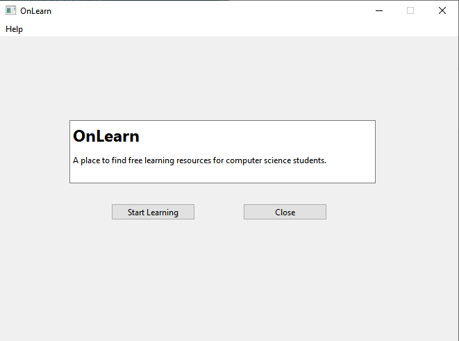

# OnLearn

 A place to find free learning resources for computer science students. 

 This is final project for CSC211H Fall 2021 semester supervised by Prof Azar

 Learn more about it by clicking the image below.

# How to try OnLearn
 <ol>
  <li> go to <a href= "https://docs.google.com/document/d/1NSBBUIcBJdUedblEdT807mBwcWOA9A3atA3eMu5eztE/edit?usp=sharing">this google docs</a> and scroll down until you find the Qt software installation guide.</li>
  <li>After finish installation, clone this repo. <a href= "https://docs.github.com/en/repositories/creating-and-managing-repositories/cloning-a-repository">(how to clone the repo)</a></li>
  <li>Open the Qt software and click file->open files or projects.</li>
  <li>Go to the directory of your local clone. find the OnLearn.pro file and click open.</li>
  <li>run the program in the Qt software and you can try the Onlearn.</li>
 </ol>
 
 # Thank you for trying my software!!!
